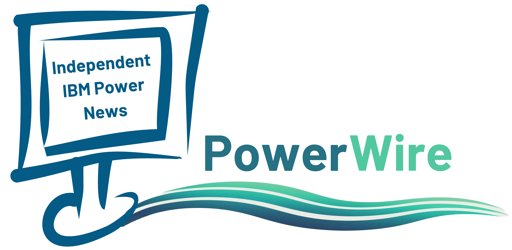

# PowerWire

## 💻 Independent IBM Power News

    
    
    
    
    
    
    
    
    

### FormaServe &amp; NC Communications Join Forces to Publish PowerWire

 FormaServe, a leading provider of IBM i training and consultancy services, and NC Communications, a specialist in
 IT events and media production, have announced a strategic partnership to publish PowerWire, the IBM Power
 newsletter.

PowerWire is a monthly online publication that covers the latest news, trends, and insights on IBM Power Systems,
including IBM i, AIX, and Linux. PowerWire aims to provide valuable information and resources for IBM Power users,
developers, administrators, and enthusiasts across the globe.

The partnership between FormaServe and NC Communications will leverage the expertise and experience of both
companies to create high-quality content and deliver it to a wider audience. FormaServe will contribute its deep
knowledge of IBM i and its applications, while NC Communications will bring its skills in media production and
distribution.

> We are delighted to partner with NC Communications to publish PowerWire, the IBM Power newsletter. We believe that this collaboration will benefit the IBM Power community by providing them with relevant and engaging content that helps them get the most out of their systems.
>
>
>> Andy Youens - Director of FormaServe.

> NC Communications is excited to join forces with FormaServe to publish PowerWire, the IBM Power newsletter. We have a long history of producing successful events and media products, and we look forward to applying our expertise to PowerWire. We are confident that this partnership will create a valuable source of information and inspiration for the IBM Power audience.
>
>
>> Nigel Clapham - Director of NC Communications.

## 🏢 Location

We are located in Manchester & London, England UK

## 👍 Contributing

We are always looking for people to write articles for our newsletter.
If you want to advertise in our newsletter and website, get it contact, it will be worthwhile.

## 📝 License

- **[MIT license](http://opensource.org/licenses/mit-license.php)**
- **© 2023 NC Communitions Ltd & [FormaServe Systems Ltd](https://www.formaserve.co.uk)**
